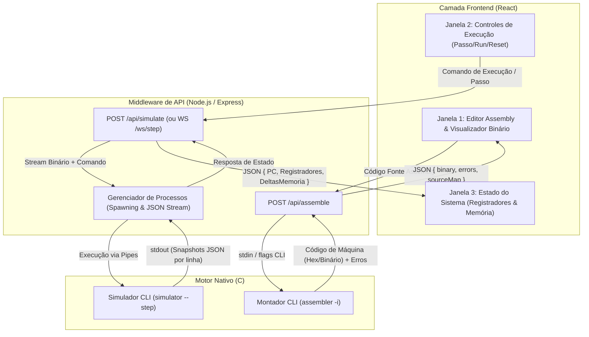

# Arquitetura do Sistema e Estruturas de Dados

Este documento descreve a organização em camadas do simulador MIC-1, o fluxo de dados entre os componentes e as definições fundamentais de estruturas de dados do motor nativo em C.

---

## 1. Visão Geral da Arquitetura

O sistema é dividido em três camadas independentes e fracamente acopladas:

1. **Frontend (React):** Interface gráfica responsável pela interação do usuário, edição de código, envio de comandos e exibição visual do estado.
2. **Middleware (Node.js / Express):** Camada de serviço responsável por gerenciar chamadas de sistema, orquestrar processos filhos (`child_process`), aplicar validações e fornecer endpoints REST/WebSocket.
3. **Motor Nativo (C):** Executáveis compilados (`assembler` e `simulator`) responsáveis pela montagem do binário e execução determinística do ciclo do processador.

---

## 2. Diagrama de Fluxo de Dados



---

## 3. Estruturas de Dados do Motor em C

Para garantir portabilidade e consistência de largura de bits entre diferentes plataformas, o código utiliza tipos definidos em `<stdint.h>`.

### 3.1 Registradores e Estado da Máquina (`simulator/simulator.h`)

> [!NOTE]
> O arquivo atual [`simulator/simulator.h`](../simulator/simulator.h) possui a definição preliminar `MIC1` (`struct componentesMIC1` com `PC`, `AC`, `SP`, `memory` e `running`). A estrutura abaixo (`Mic1Registers` / `Mic1Machine`) representa o modelo alvo expandido para suportar flags de status (Z/N) e rastreamento de ciclos para o depurador.

```c
#include <stdint.h>
#include <stdbool.h>

#define MEM_SIZE_WORDS 4096

// Estado dos registradores do MIC-1
typedef struct {
    uint16_t PC;        // Program Counter (Contador de Programa, 12 bits endereçáveis)
    int16_t  AC;        // Acumulador (16 bits sinalizados)
    uint16_t SP;        // Stack Pointer (Apontador da Pilha)
    uint16_t IR;        // Registrador de Instrução
    uint16_t TIR;       // Registrador Temporário de Instrução
    
    // Registradores do Caminho de Dados Interno (para suporte a micro-passo)
    uint16_t MAR;       // Memory Address Register
    int16_t  MDR;       // Memory Data Register
    
    // Flags de status
    bool zero_flag;     // Z-flag (resultado igual a 0)
    bool neg_flag;      // N-flag (resultado negativo)
    bool running;       // Indicador de execução ativa (ou HALT)
} Mic1Registers;

// Estado completo da máquina virtual
typedef struct {
    Mic1Registers regs;
    int16_t memory[MEM_SIZE_WORDS]; // Memória principal (4096 palavras de 16 bits)
    uint64_t cycle_count;           // Quantidade total de ciclos executados
} Mic1Machine;
```

### 3.2 Tabela de Símbolos e Tokens do Montador (`simulator/assembler.h`)

```c
#include <stdint.h>
#include <stdbool.h>
#include <stddef.h>

#define MAX_LABELS 256
#define MAX_LABEL_LEN 32

typedef enum {
    TOKEN_MNEMONIC,
    TOKEN_LABEL_DEF,
    TOKEN_LABEL_REF,
    TOKEN_IMMEDIATE,
    TOKEN_DIRECT_ADDR,
    TOKEN_EOL,
    TOKEN_EOF
} TokenType;

typedef struct {
    char name[MAX_LABEL_LEN];
    uint16_t address;
} SymbolEntry;

typedef struct {
    SymbolEntry entries[MAX_LABELS];
    size_t count;
} SymbolTable;

typedef struct {
    const char *mnemonic;
    uint8_t opcode;     // Opcode de 4 bits (0x0 a 0xF)
    bool has_operand;   // Se a instrução exige operando de 12 bits
} InstructionDescriptor;
```

---

## 4. Protocolo de Comunicação (Snapshot JSON por Linha)

Para manter o simulador em C desacoplado do Node.js, a cada avanço no modo passo a passo (`--step`), o simulador emite uma linha formatada em JSON no `stdout`:

```json
{
  "event": "STEP",
  "cycle": 14,
  "pc": 12,
  "ir": "0x100A",
  "registers": {
    "pc": 13,
    "ac": 42,
    "sp": 4095,
    "zero_flag": false,
    "neg_flag": false
  },
  "memory_deltas": [
    { "address": 4094, "prev": 0, "curr": 42 }
  ]
}
```

Essa abordagem permite que o backend em Node.js leia a saída linha a linha, repassando os deltas de memória e atualizações de registradores diretamente para a interface sem retransmitir a memória completa.

